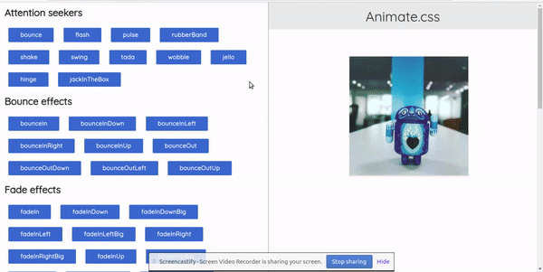

## Animate.css 

A webpage that shows every animation classes from animate.css (developed by [daneden](https://github.com/daneden).

you can visit the site here [animated.css](https://samuelbetio.github.io/LDPage/demo/animate.css/)
:wink:

download the animate.css file [here](https://github.com/samuelbetio/dGitFile/releases/tag/v7.3.2483780) to start animating

## CONTRIBUTORS.MD 
For those who contributed to MDC, you can add the following to the [CONTRIBUTORS.md](./CONTRIBUTORS.md) file
* Include your fullname name 
* and your Username in form of a link

Example 
 - [x] * [Samuel Betio](https://github.com/samuelbetio))
