# **Introduction, why find river obstructions?**

&nbsp;&nbsp;&nbsp;&nbsp;&nbsp; River obstructions in the form of dams, locks, and other such barriers, are a globally important impact that humans have had on the movement of water, sediment, organisms, and nutrients from land to sea. Despite existing datasets of the world's largest dams like [GRanD](http://sedac.ciesin.columbia.edu/data/set/grand-v1-dams-rev01), there is not a global inventory of obstructions to rivers. That is the goal of this project: Identify and categorize human-built river barriers for rivers wider than ~30 meters across the globe. 
These barriers can vary enormously in their size, volume of water disrupted, and biological permeability (can fish swim past them?). We will try to capture some of this broad variation in river obstructions, so we need to be clear about the different barriers that may cross a river, which are listed here in the [Barrier Types](#barrier-types) section.

&nbsp;&nbsp;&nbsp;&nbsp;&nbsp; We will be using Google earth engine for this project and instructions on how to use this software are detailed below. We will also be using the Global River Widths from Landsat (GRWL) dataset generated by George Allen and Tamlin Pavelsky. This dataset highlights all rivers wider than ~30m, and shows up as a yellow line in the images below. 

&nbsp;&nbsp;&nbsp;&nbsp;&nbsp; This tutorial describes the training and validation process. The purpose of this step is both to teach you how to use our Google earth engine framework to classify river obstructions, and to provide us with data to see how similarly all our volunteers classify a range of obstructions. We hope that the barrier type examples below will help guide everyone to classify obstructions similarly, but we understand that there will be variation as there is a level of subjectivity in classifying these obstructions. 

# **Set up**

Read this tutorial and/or watch this [video](https://youtu.be/QXJf9IAF1z4)

1. Sign up for Google Earth Engine: <https://earthengine.google.com/>

2. Set up a shareable Google Drive Folder
     a. Using your Google account (the same one you made your Google Earth Engine account with), open up your [Google drive](https://drive.google.com/drive/my-drive) and make a new folder in your drive to store data from the project. Please include your name in the name of the folder, ex. ‘BobJoeDamData’
     b. Once the folder is created, please share it with the group. To do this, you can right click on the folder and click ‘share.’ Next, click ‘get shareable link’ in the top right corner, and set link sharing to ‘Anyone with the link can edit.’ Lastly, click ‘copy link,’ and paste the link in this [Google Sheets document](https://docs.google.com/spreadsheets/d/1J_jvedUA3fDjD4EAYYUe-bmEszaDJWjTzlbqJJN6MXE/edit#gid=0) alongside your name.
          
```{r, echo=FALSE, out.width = '60%'}

```

```{r, echo=FALSE, out.width = '50%'}
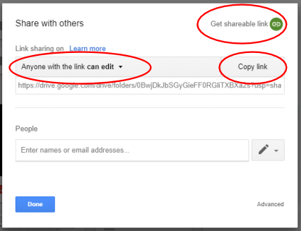
```


# **Using Google Earth Engine**

## Getting started with GROD in Google Earth Engine

1. Go to the project [Github page.](https://github.com/GlobalHydrologyLab/GROD/blob/master/1_user_interface_script/GROD_validation.js) 

2. Copy and paste everything into a blank [Google Earth Engine editor](https://code.earthengine.google.com/). 

```{r, echo=FALSE, out.width = '80%'}
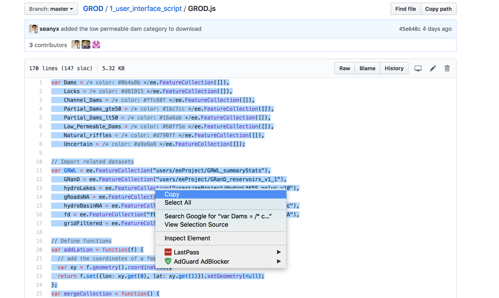
```

```{r, echo=FALSE, out.width = '80%'}
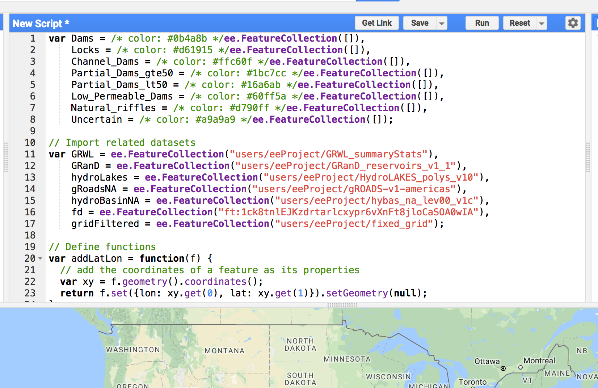
```

3. To generate all of the dam categories, you will need to convert them to import records. You can do this by hovering over the first few lines of code `var Dams =...` and earth engine will prompt you to import these records. Click convert to do so.

```{r, echo=FALSE, out.width = '100%'}
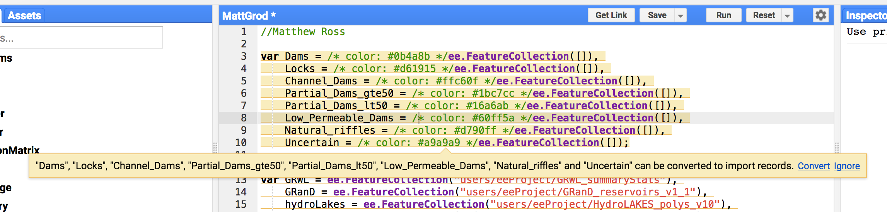
```

4. Write your name at the top of the script and hit the ‘Save’ button. This will direct you to a pop up which will ask you to create your home folder. Write your name or a nickname and then hit 'continue.' 

```{r, echo=FALSE, out.width = '100%'}
knitr::include_graphics("www/images/StartUpdated.jpg")
```


```{r, echo=FALSE, out.width = '80%'}
knitr::include_graphics("www/images/CreateHomeFolder.jpg")
```

5. Next, you will be asked to create a git repository. A git repository allows you to do version control on the project and to share all the project code with other people. Type in the name of the project, and click 'create.'

```{r, echo=FALSE, out.width = '80%'}
knitr::include_graphics("www/images/CreateGitRepo.jpg")
```

6. Lastly, you will need to hit 'save' again, and will be asked to name your script.This will save a copy of the script to your script repository. Please take note the name of the file just saved as you will need this to go back and continue your work.

```{r, echo=FALSE, out.width = '100%'}
knitr::include_graphics("www/images/StartUpdated.jpg")
```

7. Hit ‘Run’ at the center top of your screen.

```{r, echo=FALSE, out.width = '100%'}
knitr::include_graphics("www/images/StartUpdatedNo5.jpg")
```


# **Barrier types**

Here is a decision tree to help you differentiate between different types of river obstructions. Detailed descriptions of each obstruction type are listed in the next section.

```{r, echo=FALSE, out.width = '100%'}
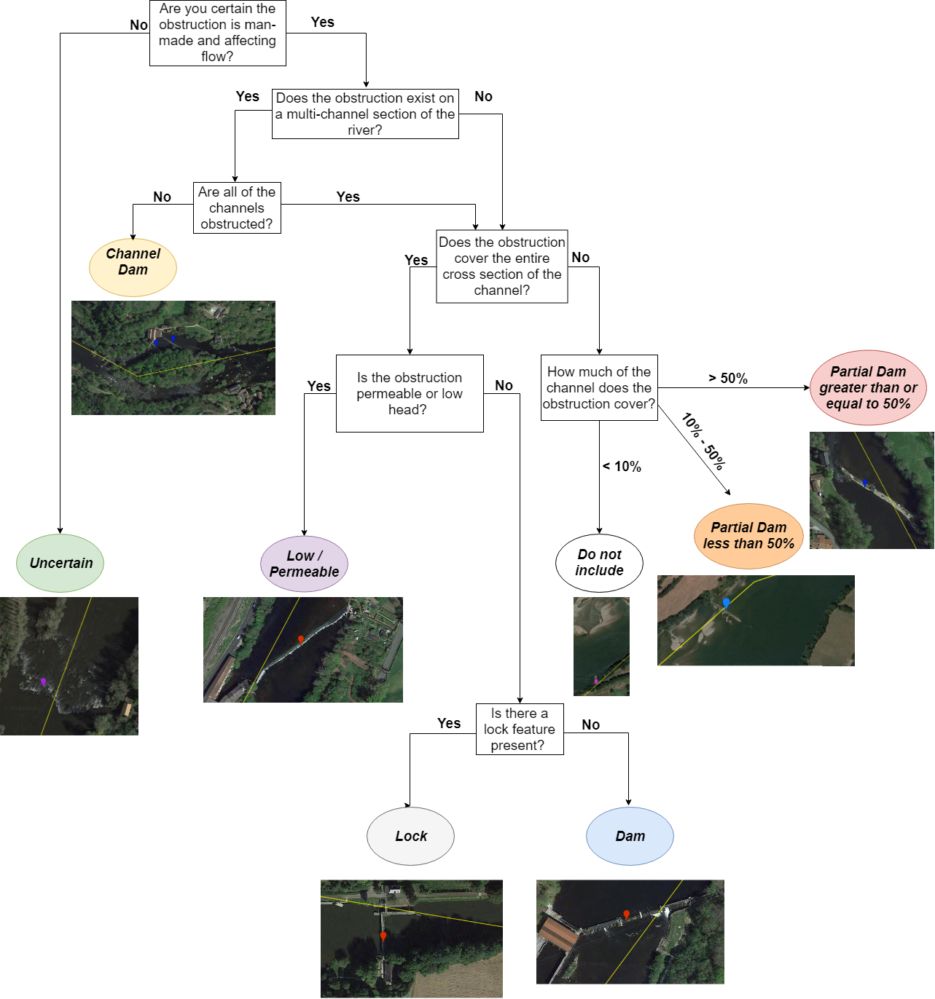
```

## Multi-channel rivers
If **fewer than all the chanels are obstructed**, please see the section on [Channel Dams](#channel-dams). Otherwise, if all the channels are obstructed, please label each obstruction individually. 

```{r, echo=FALSE, fig.cap="Multi-channel Dam Example 1", out.width = '100%'}
knitr::include_graphics("www/images/MultiChannelExample.jpg")
```


## Dams
Dams should be the most obvious barriers you will encounter. These cover the entire river channel, not allowing any water to pass through except through the dam structure itself. These are strong barriers to both the flow of water and the movement of organisms above and below the dam. Examples below. 

```{r, echo=FALSE, fig.cap="Dam Example 1", out.width = '100%'}
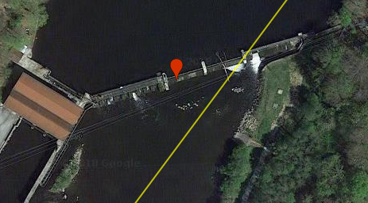
```

```{r, echo=FALSE, fig.cap="Dam Example 2", out.width = '100%'}
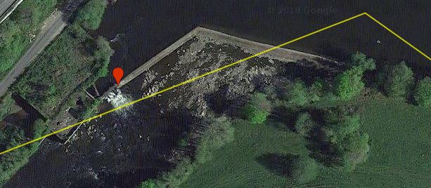
```

## Locks
Locks are a subset of dams and are structures placed on rivers to help barges and other river traffic move up and downstream, these can look a lot like dams, and typically fully obstruct the flow of water in the river, however the lock system itself can be permeable to fish who can swim into the lock area and make their way upstream, though this is still a significant barrier it is not impossible to imagine fish moving upstream. Only full dams (concrete complete channel obstruction) with lock passages should be classified as locks. 


```{r, echo=FALSE, fig.cap="Lock Example", out.width = '100%'}
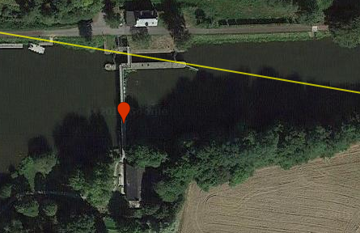
```

## Channel dams
Channel dams obstruct **less than all** of the channels on a multi-channel river. These can have significant upstream hydrologic impacts, but are less likely to alter ecological processes in the larger river section. Any type of dam (permeable, partial or otherwise) that is on a channel, should be classified as a channel dam. **If all channels are impacted by obstructions** see the [Multi-channel rivers](#multi-channel-rivers) section.

```{r, echo=FALSE, fig.cap="Channel Dam Example 1", out.width = '100%'}
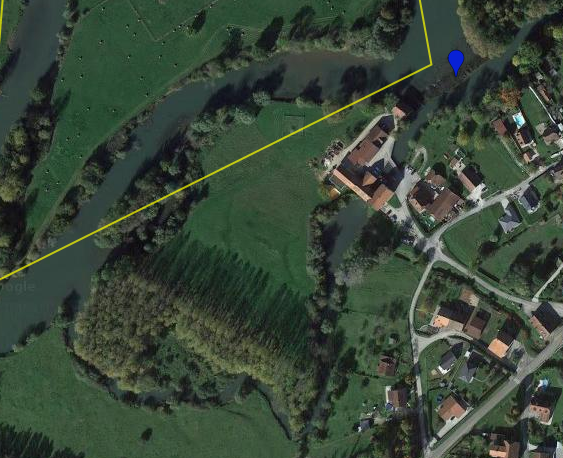
```

```{r, echo=FALSE, fig.cap="Channel Dam Example 2", out.width = '100%'}
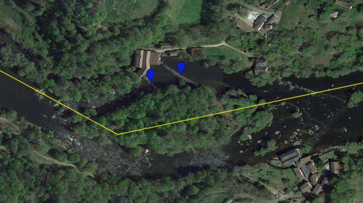
```

## Partial Dams

### Partial dams > 50%
Throughout your search for dams, you will likely encounter some dams that do not cover 100% of the river channel. For now we are just keeping track of these dams in two broad categories. Dams that cover > 50% of the channel, and dams that cover < 50% of the channel but more than 10%. These partial dams can be broken on the side of the channel or in the center but should be recorded as partial dams. 

```{r, echo=FALSE, fig.cap="Partial Dam Example 1", out.width = '80%'}
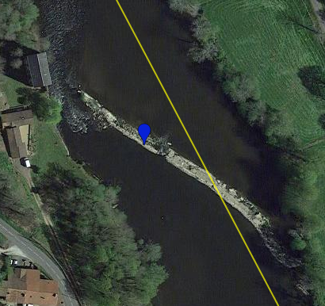
```

```{r, echo=FALSE, fig.cap="Partial Dam Example 2", out.width = '60%'}
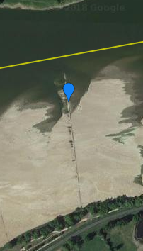
```

### Partial dams < 50%
This barrier covers about 30% of the channel and should be included in the database. 

```{r, echo=FALSE, fig.cap="Partial Dam Example 3", out.width = '100%'}
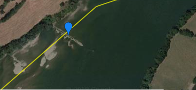
```

### Partial dams < 10% -- Ignore these
Little jetties or piers or tiny barrages will not be included in the dataset. 

```{r, echo=FALSE, fig.cap="Partial Dam Example 4", out.width = '100%'}
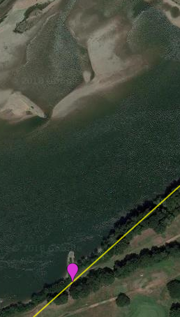
```

## Low/Permeable dams

For the purpose of this study, these dams will either have a small height difference upstream and downstream of the dam or will allow water to pass through them. These dams can look a lot like natural riffles or natural waterfalls and should only be included in the dataset if you are very sure that the structure is indeed a man-made river barrier. These will likely only be identifiable in parts of the world with higher resolution imagery. In earlier iterations of this project we called these permeable dams, but that name is misleading as one can not be sure if a dam is permeable without more focused local study. For now we have kept the permeable name in the category to keep nomenclature the same between different users, but for future work and publication these will more simply be called low-head dams. **We recognize that this is a hard category to define and ask that you use your best judgment.**

```{r, echo=FALSE, fig.cap="Low Dam 1", out.width = '100%'}
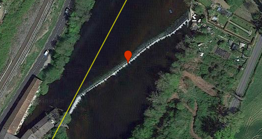
```

```{r, echo=FALSE, fig.cap="Low Dam 1 Google Street Bridge View", out.width = '100%'}
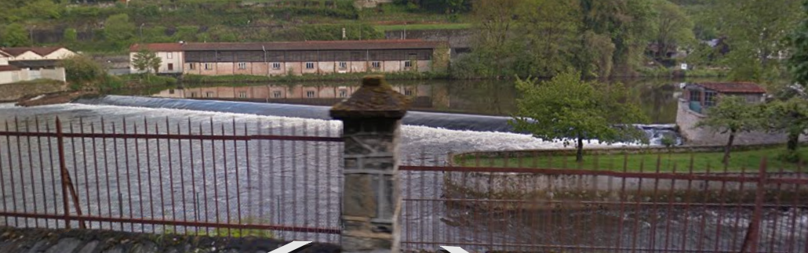
```

```{r, echo=FALSE, fig.cap="Low Dam 2", out.width = '100%'}
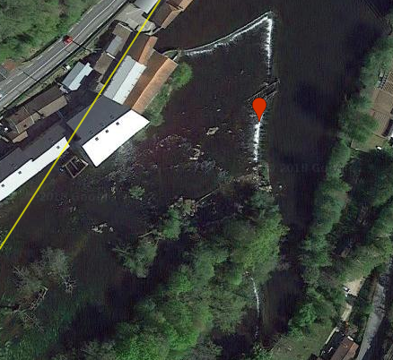
```

```{r, echo=FALSE, fig.cap="Low Dam 3", out.width = '100%'}
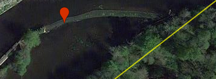
```

```{r, echo=FALSE, fig.cap="Low Dam 4 with lock feature", out.width = '100%'}
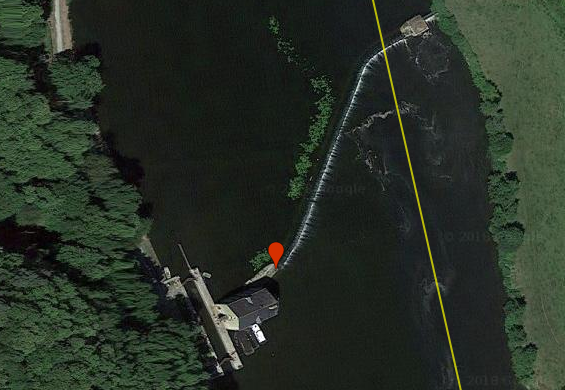
```

```{r, echo=FALSE, fig.cap="Low Dam 5", out.width = '100%'}
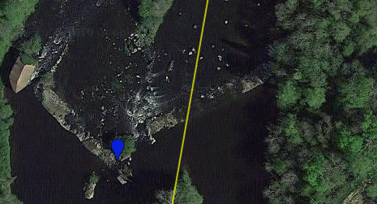
```

## Uncertain

Many times in your search you will come across structures that could either be dams or natural riffles or just a random rock slide. To be cautious in our assignments you should label these in a broad category of uncertain. 

```{r, echo=FALSE, fig.cap="Uncertain Dam 1", out.width = '70%'}
knitr::include_graphics("www/images/uncertain1.png")
```

```{r, echo=FALSE, fig.cap="Uncertain Dam 2", out.width = '100%'}
knitr::include_graphics("www/images/uncertain2.png")
```


## Natural riffles

We don’t have to record these natural features, but the category is available to you if you find it interesting or want to start a project about natural riffles. 

```{r, echo=FALSE, fig.cap="Riffle 1", out.width = '100%'}
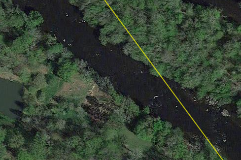
```

```{r, echo=FALSE, fig.cap="Riffle 2", out.width = '100%'}
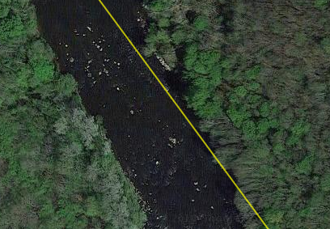
```


## No Roads

For this project we are not calling roads obstructions unless the road itself is on a dam. Sometimes there are roads sitting on top of partial earthen dams, and those should be classified as partial dams. 


# **Finding and identifying obstructions**

1. Your screen should look like the image below. You will be identifying all the river obstructions in four small regions, two in the southeast United States, and two in France. Click 'Region 1' and your map should focus in on the first region.

```{r, echo=FALSE, out.width = '70%'}
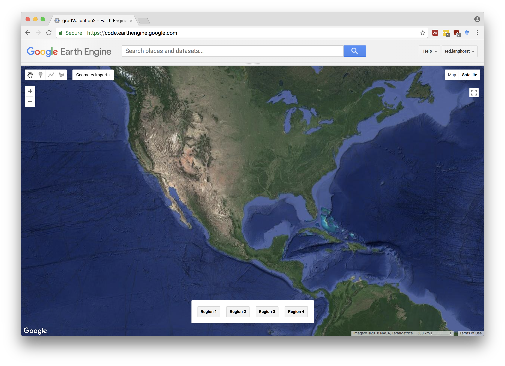
```

2. You will need to follow the yellow GRWL river lines upstream until you find an obstruction. Like here:

```{r, echo=FALSE, out.width = '70%'}
knitr::include_graphics("www/images/finding1.png")
```

3. When you find a dam, or some other obstruction you will need to click on the top left geometry bar and select the point geometry icon (shown in green).

```{r, echo=FALSE, out.width = '70%'}
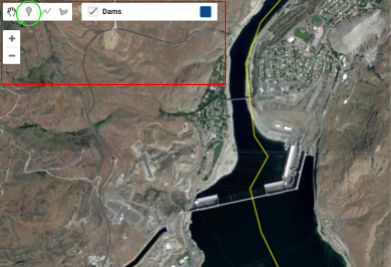
```

4. After you have selected the point type you will need to choose the obstruction type.

```{r, echo=FALSE, out.width = '70%'}
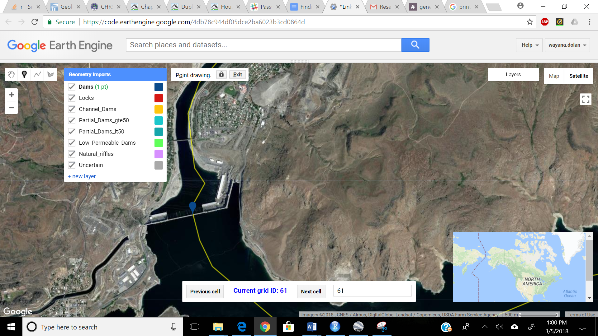
```

5. Continue to scroll along the yellow lines until you have visited all the marked rivers in the Region, and click the box to view the next area. Repeat these steps until you have identified all the river obstructions in all four regions.

### Editing

1. If you have made a mistake, click on the hand icon at the top left-hand corner of the map (see the red circle on the figure below). Next, click on the point you dislike. Lastly, hit backspace or delete on your keyboard.

2. To resume adding points, go back to the geometry bar (see the yellow box on the figure below), and click on the type of obstruction you want to add. 


```{r, echo=FALSE, out.width = '60%'}
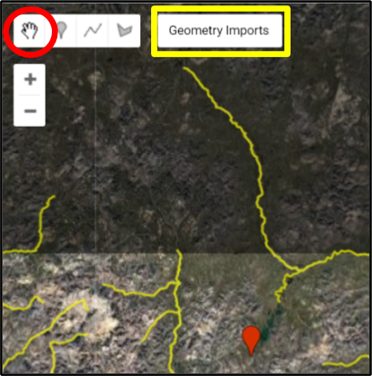
```


### Finishing up
**When you are done, or want to finish later, please do the following:**

1. Hit ‘Run’ at the top center of your screen or Ctrl + Enter on your keyboard.

2. Next, go to the ‘Task’ panel at the top right portion of your screen. You should see an item called ‘export_data.’ 

3. Hit ‘Run’ next to the ‘export_data’ item.

```{r, echo=FALSE, out.width = '90%'}
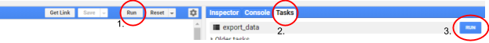
```

4. A window will pop up. Please fill it out as follows:
     a. Task name. Your name and the date in the following format:  lastName_validation
     b. Drive folder. Whatever you named your folder in Google Drive. 
     c. Filename: Same as the task name.
     d. Format. ‘CSV’

```{r, echo=FALSE, out.width = '60%'}
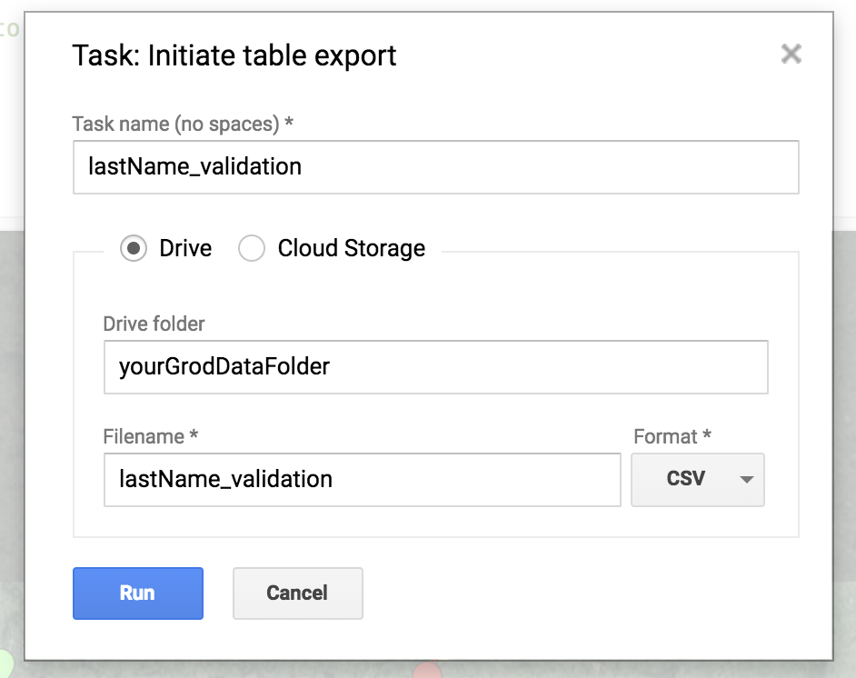
```

5. Hit ‘Run.’ 

6. Hit ‘save’ at the top of the page to save your work.

7. Check that your .csv file is in the right place, and that the data are there.

8. You’re done! 

# **Useful keyboard shortcuts**

```{r, echo=FALSE, out.width = '40%'}
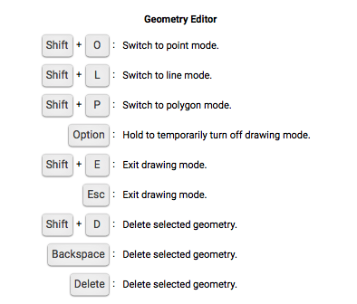
```
